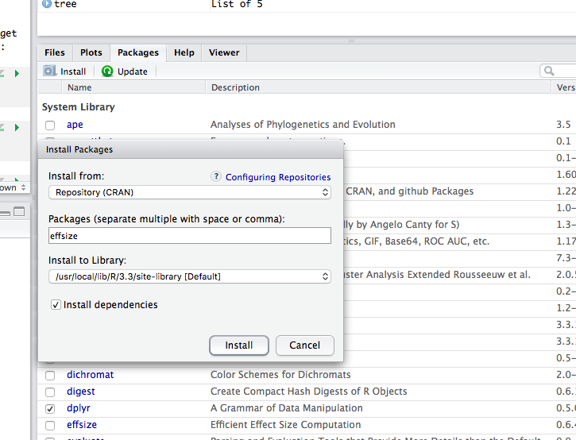

--- 
title: "Estimation Statistics"
author: "Dan MacLean"
date: "`r Sys.Date()`"
site: bookdown::bookdown_site
output: bookdown::gitbook
documentclass: book
bibliography: [book.bib, packages.bib]
biblio-style: apalike
link-citations: yes
description: ""
---

# Setting up

The primary purpose of this course is to help you to understand how to use statistics that will help with your research. The course will try to explain a branch of statistics called 'Estimation Statistics' which are complementary to the normal sort of hypothesis test procedures and address some of the criticisms of those methods.

Statistics is a computationally heavy topic, so we'll be making use of the R statistical programming environment to do that side of the work. The rest of this chapter will help you get that set up on your own computer.

## Prerequisites

### Knowledge prerequisites

There are no specific knowledge prerequisites for this book but it will help if you have read and worked through the `ggplot` and `Intro to Stats` books and are familiar with R use.


### Software prerequisites

You need to install the following stuff for this book: 

 1. R
 2. RStudio
 3. Some R packages: `devtools` and `besthr`
 

## Installing R

Follow this link and install the right version for your operating system [https://www.stats.bris.ac.uk/R/](https://www.stats.bris.ac.uk/R/)

## Installing RStudio

Follow this link and install the right version for your operating system [https://www.rstudio.com/products/rstudio/download/](https://www.rstudio.com/products/rstudio/download/)

## Installing R packages in RStudio.
### Standard packages - `devtools`

`devtools` is a standard R package and can be installed like any other you may have done from CRAN. Start RStudio and use the `Packages` tab in lower right panel. Click the install button (top left of the panel) and enter the package name, then click install as in this picture



In the same way, you should install `effectsize`.

### Development packages - itssl

`itssl` is a new package that contains all the materials including the exercises for this handbook. As it is a development package you need to install it using `devtools`.

  1. In the `Console` tab in the lower left panel of RStudio type `devtools::install_github("danmaclean/besthr")`
  
You may get asked to install newer versions of packages, select `1. All` for these questions.


```{r include=FALSE}
# automatically create a bib database for R packages
knitr::write_bib(c(
  .packages(), 'bookdown', 'knitr', 'rmarkdown'
), 'packages.bib')
```