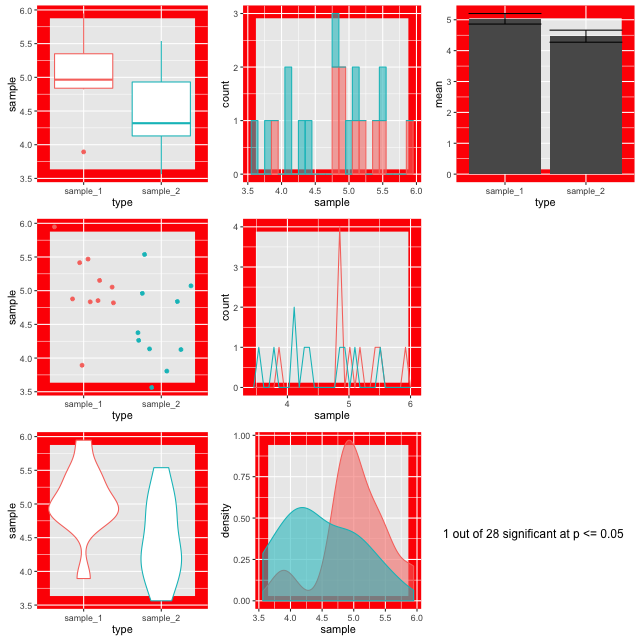

# Motivation

## Variability in measurements

Variability in measurements is a thing that happens as a natural consequence of working with complex systems that are affected by many variables in stochastic ways. Biological systems are some of the most variable we know. The variability in our experiments could be a function of the behaviour of the system yet it is common practice to hide that variability when we start to analyse our data by using summary plots like box-plots.  Ultimately, that's bad news for our science, because the variability could be telling us something.

## Summarising your data can lead to wrong conclusions

We all know that when you create a bar chart and put some error bars on it, you're really only representing two numbers, usually a mean and standard deviation. People create bar plots out of habit and without thinking about it, and in doing so can miss important stuff. Look at this figure from @weissgerber2015:  


The bar chart in panel A is one that emerges if we use each of those data sets in the other panels. But creating the bar chart really hides some important stuff, like the fact the numbers are clearly separating into two groups in panel D, or that the two samples have different sizes in panel E.

Worse than any of these is that the significant difference in the t-test is coming from just one point in panel C. From this data set you might be tempted to conclude that there is a significant difference in the two samples and if you relied on the bar chart as a visualisation then you'd never suspect there was something funny.  

Some enthusiastic young science communicators have even started a Kickstarter to lobby journals to stop using, in particular, bar charts! These people, calling themselves Bar Barplots, have a nice video on one of the main problems with  bar charts. Have a look at this page on Kickstarter . [Kickstarter - Barbarplots](https://www.kickstarter.com/projects/1474588473/barbarplots), especially this video [Kickstarter - Barbarplots video ](https://ksr-video.imgix.net/projects/2453455/video-665338-h264_high.mp4).


Ignoring your data visualisation and just making bar plots could be an error! It's important that you spend a little time getting to know, and presenting your data as clearly and thoroughly as possible.  

## _p_ - one value to fool them all?

A lot of researchers get the impression that $t$-tests, ANOVAs and other hypothesis tests tell you whether something is significant with probability $p$. This is quite a misinterpretation. They do no such thing. More accurately but still rather informally and in general $p$ can be taken as follows

```{block2, type="myquote"}
$p$ is the likelihood of seeing a difference of the size observed in the Null Model
```

Remembering that the Null Model is the default situation where the difference is 0 then this is resolutely not the same as saying they are definitely different. Just that they're not likely to be the same. The $p$ in $p$ value is usually taken to mean 'probability', but if it stands for anything it should be 'probably not the same'. 

Hypothesis testing like this has been criticised for being weak inference, and not without reason. All this means is that we need to be awake to the limitations of our methods.

$p$-values may well be the most abused statisic in the world, and it is probably time to retire it as a go-to statistical tool. In the end won't a _p_-value help you see real differences and make this all easy? Sadly, that isn't true. Let's do an experiment to test that.

### Ten Thousand Random Numbers
Below is a set of figures that show different views of the same set of data. Every frame of the 100 frames shows a different sampling from the same pool of 10,000 random normally distributed numbers.


Step-by-step, here's how these figures are made.

1. Generate a pool of 10,000 random numbers (mean 5, SD 1)
2. From that, select 10 and call it sample 1.
3. Select another 10, call it sample 2.
4. Draw plots comparing each sample
5. Do an independent _t_-test on the sample 1 and sample 2 to test for significant differences in means.

The figures are plotted with a red border if _p_ comes up less than 0.05. The thing is, the samples are from the same background pool, so intuitively you might suspect that none should be different from the others. The reason that some of them do is because a _p_ value only states that the difference observed occurs by chance in _p_ of all events, so for 100, we'd expect 5 to be marked out by chance. In this run of the experiment we get three. Here's a couple:




Look at the different plots for each. It is observable that for all these the barplots look very convincingly different. But in the context with the other plots its clear that they aren't showing the whole of the story (or in fact much of it). The boxplots (top left) do a good job of showing the range and the violin and density plots (bottom row) do a good job of showing the shape. It is only really the point plot (first column, middle row) that reveals the positions of the data points and shows that the conclusion of the _p_ value is likely skewed by one or two points in each sample. Concluding differences on this basis is _really_ unsafe. 

Hence, the conclusion from this is that a range of visualisations is necessary to allow us to have confidence in our _p_ values and understand the shapes of our data. Drawing box plots and sticking to _p_ religiously is going to make us wrong more than we'd like! 

## Estimation Statistics 

So what can we do about this apparent problem? One strategy is to take a much less hypothesis test-centric approach to statistical analysis and apply other ways of thinking about the problems, instead we can use Estimation Statistics to look at the parameters of our data and get an idea of magnitude of an effect or difference and an associated confidence interval that estimates how believable that estimate is.

```{block2, type="sidenote" }
Hey, isn't all this rationale in the ggplot book?  Umm, it is a bit, yeah! Graphical methods and Estimation Statistics are closely related because plots can show the parameters very well
```

In this book we'll take a look at some of the main features of Estimation Statistics with the intention that they'll be useful in your future research. The same rule about taking a $p$-value as your only determinant of whether a statistical claim is important or significant applies to the Estimation Statistics we'll learn here. At the end of this book we will examine the integration of the different estimate statistics covered.


